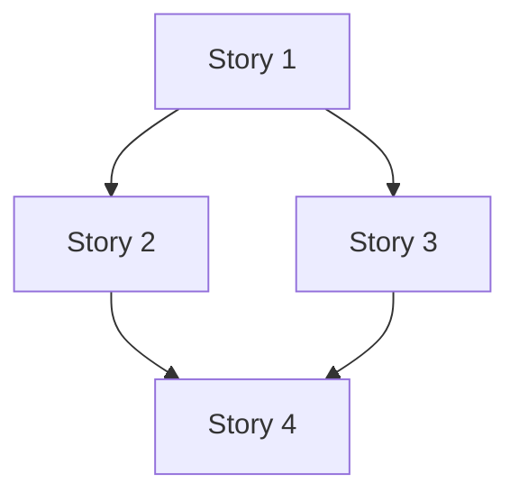

# Task Graph: [Epic Name]

> **Epic ID:** [E-NNN]
> **Date:** YYYY-MM-DD
> **Status:** Draft | Approved
> **Version:** 0.1.0

## Dependency Graph

## Story List

| ID | Title | Priority | Status |
|---|---|---|---|
| [S-001] | [Title] | [P0] | [Todo] |

---
*Written by: agentic-sdlc story-breakdown skill*
