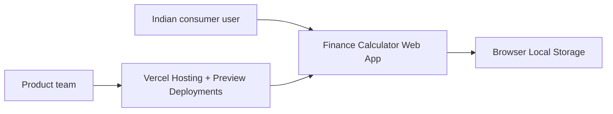
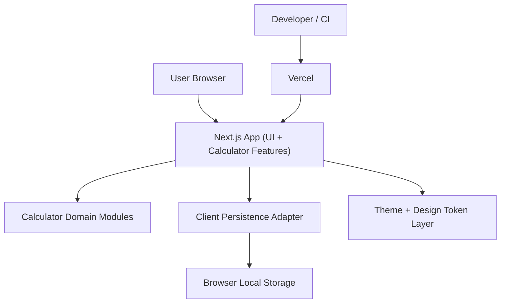
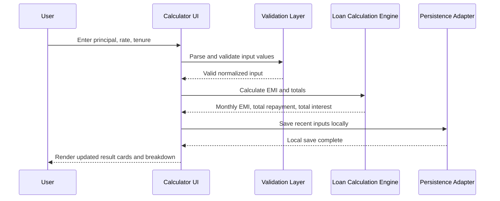
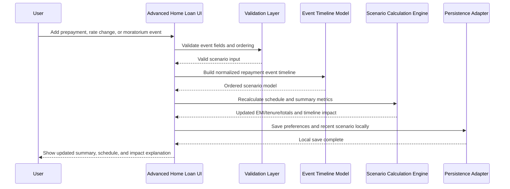
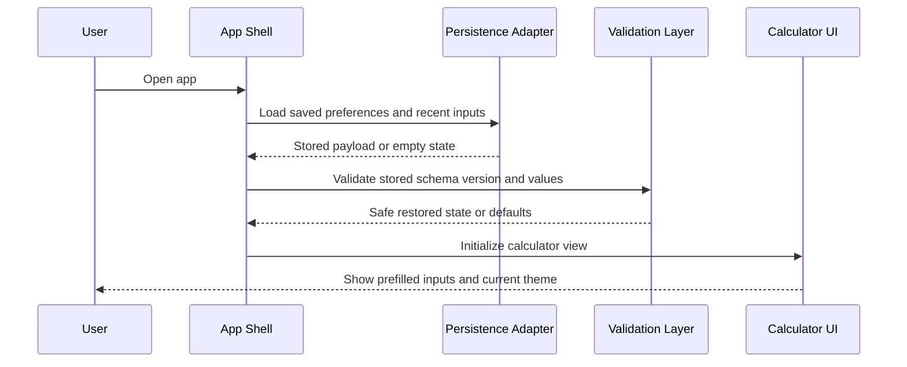

# Technical Architecture

> **Status:** Draft complete
> **Stage:** tech-architecture
> **Last updated:** 2026-04-08

## Architecture Summary

Version 1 will be a frontend-first Next.js web application deployed on Vercel. Calculator logic will live in typed, testable domain modules on the client, while browser local storage will persist low-risk preferences and recent inputs. No server database or authentication system will be introduced in V1.

This architecture optimizes for speed to market, trust, and maintainability. It keeps the product simple enough for a 3 to 5 week delivery window while preserving a clean upgrade path for future SEO expansion, account-based sync, or external rate integrations.

## System Context (C4 Level 1)



## Container Diagram (C4 Level 2)



## Key Sequence Diagrams

### Simple Loan Calculation



### Advanced Home Loan Scenario



### Returning User with Saved Preferences



## Directory Structure

```text
docs/
  architecture/
    adrs/                       Architecture decision records
    coding-standards.md         Binding coding constitution
    domain-model.md             Product and finance domain context
    tech-architecture.md        System architecture and diagrams
  product/
    accessibility.md            Accessibility requirements
    design-system.md            Tokens, components, interaction language
    features/
      brd.md                    Approved business requirements
src/
  app/
    page.tsx                    Marketing and calculator landing entry
    layout.tsx                  Root layout, fonts, theme bootstrap
    calculators/
      personal-loan/
      home-loan/
      sip/
      fixed-deposit/
  components/
    primitives/                 Buttons, inputs, cards, tabs, accordions
    layout/                     Header, footer, shells, section wrappers
    charts/                     Optional visual breakdown components
  features/
    calculators/
      personal-loan/
      home-loan/
      sip/
      fixed-deposit/
    preferences/                Theme and local persistence features
  lib/
    calculations/               Pure financial formulas and scenario engines
    validation/                 Input parsers and schema validation
    storage/                    Versioned local storage adapter
    formatters/                 Currency, percent, and date formatting
  styles/
    globals.css                 Global tokens and theme variables
  test/
    fixtures/
    helpers/
```

## ADR Summary

| ADR | Decision | Status |
|---|---|---|
| ADR-001 | TypeScript on Node.js 22 LTS | Accepted |
| ADR-002 | Next.js with React and Tailwind CSS | Accepted |
| ADR-003 | No server-side database in V1; browser local storage only | Accepted |
| ADR-004 | No authentication in V1 | Accepted |
| ADR-005 | Deploy on Vercel with automated quality checks | Accepted |

## Security Approach

- Auth strategy: no authentication in V1 because the product is a public calculator experience with local-only persistence
- Secrets management: environment variables only for any future deployment keys or analytics configuration
- Input validation: parse and validate every user input before any calculation or storage write
- Persistence safety: version local storage payloads and reject malformed or incompatible stored data
- Dependency scanning: run dependency audit checks in CI
- Content trust: clearly label estimates, assumptions, and disclaimers so outputs are not mistaken for personalized advice

## Testing Approach

- Unit tests cover calculator formulas, advanced home loan event sequencing, and formatter behavior
- Integration tests cover calculator forms, result summaries, and local persistence workflows
- End-to-end tests cover calculator completion under target flows on desktop and mobile viewports

## Operational Notes

- V1 has no backend services, so uptime risk centers on hosting, static asset delivery, and client-side runtime stability
- Future additions such as account sync, lender-specific logic, or live rate feeds require new ADRs and a HITL checkpoint before implementation
